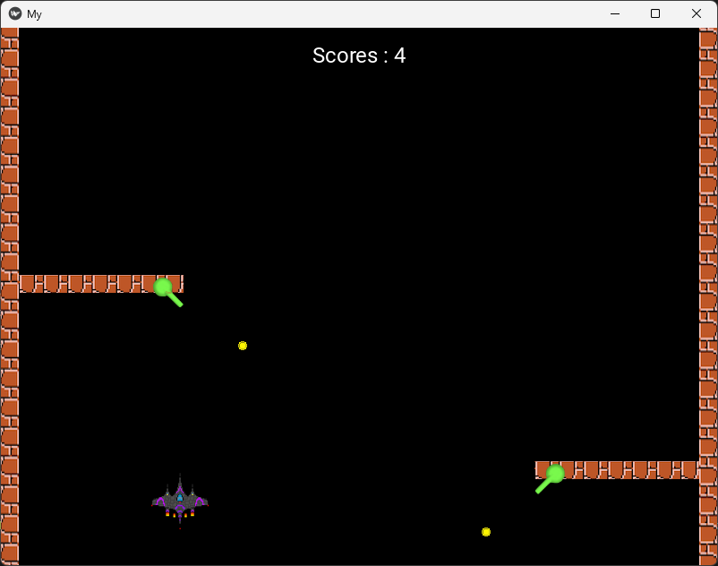
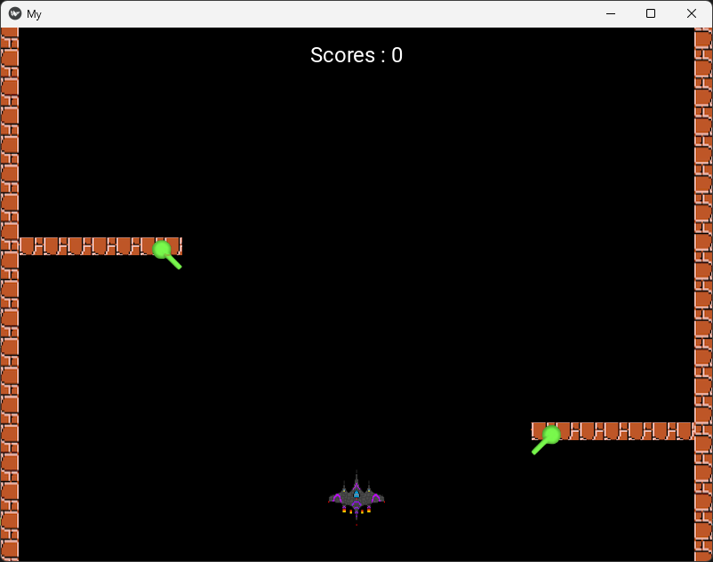

# Battlefield Part 2 🎮  
*A 2D Shooting Game built with Python and Kivy*

This is my small game project developed for my **Games Technology** course.  
It’s built using the **Kivy** framework and includes simple animations, collision detection, and scoring logic.

---

## 🎨 Game Preview




---


## 🕹️ Game Overview
- Two **barriers** move vertically on the screen.
- Each barrier has a **fire launcher** attached that fires diagonally every second.
- The **fighter** (player) can move left and right and shoot missiles.
- If the fighter’s missile hits a launcher **20 times**, that launcher breaks and becomes inactive.
- A **broken launcher** stops firing until it reappears from the top of the screen.
- Every demolished launcher increases your **score by 1**.
- Launchers reset to normal when they come back from the top.

---

## 🧱 Features
✅ Diagonal projectile motion  
✅ Collision detection between missiles and launchers  
✅ Launcher state control (active / damaged / reset)  
✅ Score system with live updates  
✅ Kivy scheduling for timed firing and game loop  

---

## 🧠 What I Learned
- Working with **Kivy graphics and animation loops**  
- Using **Clock.schedule_interval** for periodic actions  
- Implementing **collision detection** in 2D space  
- Managing **game state and object interactions**  

---

## 🛠️ Tech Stack
- **Python 3**
- **Kivy**

---

## ▶️ How to Run
1. Clone or download this repository  
2. Install Kivy:
   ```bash
   pip install kivy
Made with ❤️ using Python and Kivy

